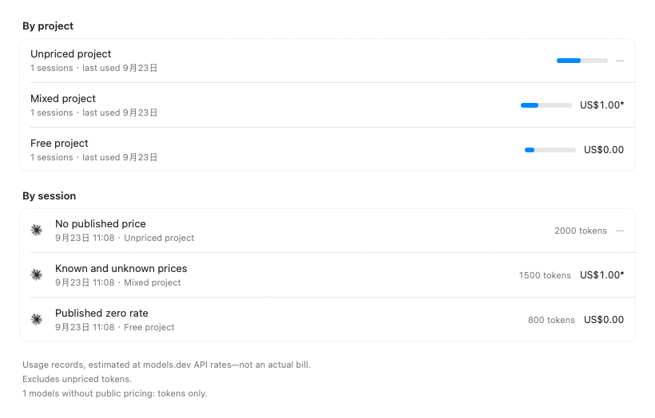
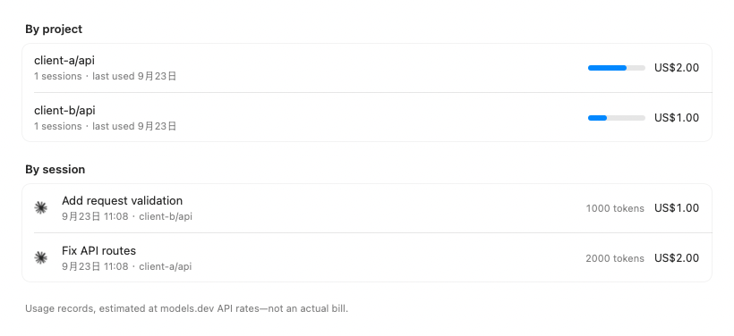

# Token spend

Owns: the Settings pane that answers *across everything I use, where did the work go* — its agents, its readers, and what may and may not be said about the figures. The per-provider history card is a different thing and lives in [refresh-and-data.md](refresh-and-data.md).

Source: [`SpendAgent`](../Sources/Pulse/Usage/SpendAgent.swift), [`AgentLedgers`](../Sources/Pulse/Usage/AgentLedgers.swift), [`AgentCache`](../Sources/Pulse/Usage/AgentCache.swift), [`AgentUsageRecord`](../Sources/Pulse/Usage/AgentUsageRecord.swift), [`AgentLogIO`](../Sources/Pulse/Usage/AgentLogIO.swift), [`AgentSQLite`](../Sources/Pulse/Usage/AgentSQLite.swift), the reader families under [`Usage/Readers`](../Sources/Pulse/Usage/Readers), [`SpendSummary`](../Sources/Pulse/Usage/SpendSummary.swift), [`ModelSpendSummary`](../Sources/Pulse/Usage/ModelSpendSummary.swift), [`TokenSpendView`](../Sources/Pulse/Settings/TokenSpendView.swift), [`ModelSpendDetailView`](../Sources/Pulse/Settings/ModelSpendDetailView.swift). The complete source catalog — every store, its default macOS path, the counters it reports and how well that is evidenced — is [token-spend-sources.md](token-spend-sources.md).

It counts the last **week** until the reader picks another span, and the pick is kept for the next visit and the next launch (`AppSettings.spendSpan`; `SpendSpan.default` is `.week`). A stored value the picker no longer offers falls back to the week.

## Opt-in reading and cancellation

**Reading is off by default, including on upgrade.** `AppSettings.readsTokenSpend` has its own persisted key and does not call the quota providers' `onChange` hook. The pane stays reachable while off, showing only its switch and an explanation. Opening it in that state does not discover sources, read records/exports/caches, or request prices. Claude Code and Codex's account-history cards remain independent of this switch.

Once enabled, the first visit checks the disk caches and reads changed sources. A completed snapshot stays with the Settings window: switching to another sidebar pane and back displays those figures immediately, without source discovery, fingerprinting, cache-file loading or another price request. A successfully empty result and any read-limit notes are retained too. **Rescan** explicitly updates the figures and bypasses the complete-agent caches; transcript readers still reuse unchanged per-file entries. The page names the source currently being read and its position in the detected source list, not an estimated percentage of bytes or time.

One SwiftUI task owns entry and manual rescans. Turning the switch off, navigating away, or closing the Settings window cancels an unfinished task. `SpendReadState` retains only completed snapshots across sidebar changes; an unfinished first read is retried on return. Window visibility and the enabled flag remain separate parts of the task id even on other panes, so closing the window after navigating away still releases the snapshot and all derived summaries. Closing an AppKit window that retains its hosting view does not necessarily remove the SwiftUI view. A read id prevents a cancelled predecessor from publishing results or clearing a replacement's loading state. Turning reading off or closing Settings releases the window's result; `AgentLedgers` keeps no second process-lifetime copy. An explicit rescan releases the old detail before allocating its replacement, keeping at most one completed snapshot.

Cancellation is cooperative **inside** the readers: line and chunk reads, directory enumeration, record aggregation, SQLite row iteration and VM progress, and zstd output chunks check the caller's task. Synchronous whole-JSON/cache codec calls finish their current operation before the next checkpoint; cancellation does not let the reader carry on through the remaining sources. It is not a global flag, so cancelling this pane does not cancel an account-history task. A cancelled read is neither published nor saved as a complete cache, and cache writers recheck cancellation before writing. Already completed valid caches remain usable.

## Pricing a model its own maker does not publish

`ModelPrices.providers` is twelve first-party vendors and stays that way: a reseller re-listing somebody else's model at a markup is not that model's price. But some models are **only** sold through a plan — `deepseek-v4.1-flash` is real, OpenCode Go sells it, and DeepSeek's own models.dev entry does not list it — so the choice was a figure at the rate the tokens were actually bought at, or no figure at all.

`SpendAgent.priceVendor` names the models.dev vendor an agent's plan is sold by (`opencode-go`, `kilo`, `cline-pass`). Those vendors' rates are stored **namespaced** as `vendor|id`, which is what makes them unreachable except to a lookup that asked for that vendor, and what keeps them from colliding with a first-party id. `ModelPrices.price(for:in:vendor:)` tries first-party spellings and aliases first and only then the vendor; a first-party price always wins. An agent that calls the model vendors directly has no `priceVendor`, because its models already have a published rate and a plan price would be a second answer to a settled question.

The vendor is passed through the shared pricing pass for **days, slots, model amounts and sessions**. OpenCode and Kilo CLI share a database reader, but the caller supplies each agent's own vendor. `VendorPriceTests` pins the lookup rules and exercises both production database routes and the normalized-record chain, so a priced session cannot coexist with an unpriced headline for the same tokens. Price-table cache version 4 forces pre-vendor tables to be fetched again on upgrade.

## Model details

Every model row opens its token details, including when only one model is listed. Models beyond the initial eight remain reachable. Opening a model from the overview counts every agent that used it; opening one inside an agent keeps that agent as the scope. Back returns to the model list in that scope. The selected model is temporary navigation state; the shared span remains the reader's saved preference.

The detail shows the model's token total and API cost estimate, input/output/cache split with amounts, daily and hourly token usage, contributions by agent with amounts, and a paged daily table with a sortable cost column. A model with nothing in a newly selected span stays open with an empty state so the reader can widen the span or go back. Opening a model and changing its span only summarize the ledgers already in memory; **Rescan** is the explicit reread.

Abbreviated text figures expose exact token counts through their system help tags. A known zero is `0`; an unavailable daily breakdown or amount is `—`. Sorting a numeric column leaves unavailable values last in either direction and uses the date to resolve ties.

Daily and hourly charts use the same immediate `ChartHoverOverlay` as account history. Moving anywhere within the plot selects the nearest column, including short and zero-count bars: a guide identifies it and a compact label shows its date (with year) or hour plus an abbreviated token count. The count uses `TokenCount.short`, matching the rest of the pane: 万/亿 in Simplified Chinese, the corresponding units in the other East Asian languages, and K/M/B in English. The label fits beside the column and stays within the chart at either edge, without resizing the card or delaying for a system help tag. Leaving the chart, changing the data/span, or leaving the view clears it. Bars also expose their date/hour and exact count to VoiceOver; unavailable hourly detail remains unavailable rather than getting an invented series.

`ModelSpendSummary` matches the list's exact grouping key (`ledger.modelNames[rawID] ?? rawID`), including multiple raw IDs with the same published name. It adds only local and imported counts within the selected calendar span, fills quiet days, and keeps unpriced models' tokens. Per-model token tallies and quarter-hour counts come from the shared reader's original buckets. A missing or incomplete split is unavailable, never an agent-wide split borrowed for the model; hourly counts must reconcile separately for each agent, calendar day and raw model ID. The daily, agent and headline totals describe the same model and span.

### Model amounts

The shared pricing pass prices each raw model ID's own input, output, cache-write and cache-read counts at that model's published API rates per million tokens. The existing cache-rate fallback to input pricing still applies. `TokenCost` keeps those four amounts, and `LedgerDay.modelCosts` retains them by raw model ID. Aliases and agents are combined **after** pricing, so two IDs with the same display name can retain different rates. The model detail sums these saved amounts for its selected span and agent scope; it neither requests another price table on click nor allocates a day's combined cost by token share.

These are USD API estimates, not subscription charges. `costBreakdown`/`cost` are absent if none of a model's tokens can be priced; a published zero rate produces a real zero amount. If only part can be priced, the amount is that part's subtotal and `unpricedTokens` names the excluded token count. The headline labels a partial estimate, and affected Agent/day amounts are visibly marked. Category amounts cover the same priced subset. Missing per-model cost metadata or inconsistent token detail is left unpriced rather than reconstructed from a combined total.

Positive amounts below one cent display as less than $0.01; true zero remains $0.00. Hover values use higher precision, including for tiny amounts. Formatting follows the selected locale while the currency remains USD.

## An agent is not a provider

A **provider** is something Pulse can draw a ring for: it reports a quota, it has a settings pane, it can be signed in to. An **agent** is something that has *spent* tokens on this Mac. The two lists overlap and are not the same:

- Kimi's CLI, Kilo CLI and OpenCode leave transcripts here and sell no plan Pulse watches.
- Most of the added sources (the editor logs, the per-product stores, the export caches) are not providers Pulse draws a ring for at all.

Folding the first group into `Provider` would put rings on the rail for products with no limit anyone can check. So the pane has its own type, and nothing it does reaches the panel.

## Nothing on this page is on the rail

The rail is what is **left**; this is what is **gone**. It is Settings-only for the same reason the per-provider card is: it is read off hundreds of megabytes of local stores rather than from a live endpoint, and it answers a sit-down question rather than a glance.

## Which agents, and on what evidence

The catalogue recognizes **54 sources**. Seven — Claude Code, Codex, OpenCode, Kilo CLI, Grok Build, Kimi CLI and Devin CLI — were read on a real machine with real work in them and keep their existing readers. The remaining 47 entries use the reader families checked with original synthetic stores. Compatibility-spec coverage is not blanket proof of live-client correctness; source-specific observations, prerequisites and limits are recorded in [token-spend-sources.md](token-spend-sources.md).

That evidence distinction is the admission rule. A second-hand format spec pins a shape against change; it is not proof the shape is right, and a guessed transcript format fails silently — it does not throw, it produces a wrong number nobody can see is wrong. The added readers are held to the same discipline the machine-read ones are: a store that reports no tokens contributes no record (never a zero), a store that only estimates is not shown as usage, and a source that needs an export says so instead of pretending to read the product.

The pane therefore never describes 54 agents as if each yields tokens on a fresh install. Most need their product installed and used, and the six export/cache clients (`cursor`, `antigravity`, `trae`, `warp`, `hindsight`, `mcode`) need a prior export or capture — or a file in Pulse's own `UsageImports/<client>` folder — before there is anything to read.

Sources detected locally but yielding no counted tokens appear under **No usage data read** (「未读取到用量」). This uses the full scanned history, not the selected span; it describes what Pulse read, not proof that the source has never been used.

### How the work is read

- `SpendAgent` is the whole catalogue (54 cases). Its `sourceID` is the canonical string the readers dispatch on, `hasCapturedValidation` marks the seven checked against a real store, and `reportsTokenCounts`/`requiresUsageExport` say whether a token figure is a measurement and whether the store is an export rather than a native log.
- `AgentLedgers.scan` returns a snapshot of one `UsageLedger` per present agent and that same scan's read-limit notes. Claude Code and Codex are **delegated** to `UsageLedgerReader`, the reader the per-provider card already uses; the five other legacy agents keep the store readers that were split out of the actor into their own files (`OpenCodeStore`, `GrokStore`, `KimiCLIStore`, `DevinCLIStore`). Everything added since is handed to `AgentRecordReaders`, one router over six families in [`Usage/Readers`](../Sources/Pulse/Usage/Readers) — session logs (Group A), editor logs (Group B), databases (Group C), per-product stores (Group D), exports/captures (Group E) and Copilot (Group F).
- `AgentRecordReaders` exposes the same pair every family does: `inputs(client:home:environment:)` names every file the client would be read from — including metadata registries and referenced databases, and including a root that does not exist yet, so the cache watches the real sources — and `records(client:roots:)` turns those roots into `AgentUsageRecord` **increments**. Readers read; they never price.
- Devin's Desktop route also receives the native databases the catalogue is counting. A capture matched unambiguously to a session with usable database counters is excluded before pricing; metadata alone never suppresses a capture. Both sources remain readable independently. The source-precedence rule and its limits are in [token-spend-sources.md](token-spend-sources.md#cross-source-routing-and-dedup).
- `AgentUsageLedger.build` turns records into the same days, models, sessions and quarter-hour slots the transcript readers make, through the shared `UsageLedgerReader.slotKey`/`.price`. One pricing path, one bucketing rule. `AgentLogIO` and `AgentSQLite` are the shared file/JSON/time and read-only-database helpers, so two readers cannot disagree about what "malformed" or "missing" means.
- **A read a reader cannot finish is stated, not silently short.** A reader can meet history it cannot decode — a compressed transcript with no local zstd library, a corrupt frame, a payload over the size bound. `AgentRecordReaders.notes` reports the limit, the pane says some compressed records could not be read, and that read is **not** persisted to the disk cache. User cancellation instead discards the result; it is not a corrupt-record diagnostic. See [Caching](#caching).

### Unclassified, incomplete and coarse are three different things

A record's tokens are the four classified kinds **plus** `unclassifiedTokens`: work the source reported as a bare or session total without a kind. Those tokens are counted in the day, model, session and unpriced figures and listed per raw model id in `LedgerDay.modelUnclassifiedTokens`, but they are **never** put into `input` and **never** costed. A tallied split is shown only when the classified kinds plus the explicit unclassified remainder equal the model's total; otherwise the category split is unavailable rather than zero. A partial cost is the priced classified subset, with `unpricedTokens` naming the rest.

`isPartial` is a **different** statement: the source could read its counts but could not prove they are the whole of its work — an ambiguous cache or reasoning relation, a lane that may not cover the store's lifetime, a row with no identity that some other lane might also hold. It is a **known subset**. `AgentUsageLedger.build` propagates it to `UsageLedger.hasPartialCounts`, then to `SpendSummary` and `ModelSpendSummary`, and the pane says **"Counts may be incomplete."** The flag adds and guesses nothing: no tokens are invented from it and no price changes. It is explicitly **not** the same as an unclassified remainder (where the total is complete but a kind is unknown) and **not** the same as aggregate timing (where the counts are as reported but the clock is coarse). All three can be present at once and each is surfaced on its own.

`isAggregate` marks a record whose only timing is session- or report-level. It lands on its real calendar day but not in a quarter-hour bucket, and a ledger carrying `hasAggregateTiming` withholds the hour profile for the whole scope rather than inventing one. Aggregate timing is coarse by definition; a session report cannot be turned into an hour series. Its session nevertheless keeps **calendar-day buckets**, including both event and aggregate records in a mixed session, so selecting Today does not include yesterday's report. `SpendSummary` uses those day buckets when a session has no trustworthy quarter-hours; only older in-memory ledgers with neither kind of bucket use the whole-session fallback.

`UsageLedger.Origin` says where the figures came from: `.localTranscripts` (a built-in reader), `.importedRecords` (a capture, a dropped log, or another tool's store) and `.providerStatistics` (a provider's account-wide reply). The six export/capture clients are built with `.importedRecords`; everything read from a native log is `.localTranscripts`. The first two can be priced; a provider's statistics carry no money and are **excluded from every priced total**, so they can never pad the page with a figure half of which cannot carry a cost. The pane reads "local records and exports", and the footnote identifies the figures as usage records estimated at published API rates rather than a bill.

## What the readers agree on

- **Money is `ModelPrices`, always.** Wherever a store keeps its own cost column or a provider reports cost — OpenCode, Cursor, Warp, Unsloth, Gajae Code, Junie, Fx and others — it is **not** carried into the priced totals. It is whatever that app or server believed at the time, is zero for a plan it has no rate for, and mixing it in would put two differently-sourced figures in one total.
- **A store with no counters contributes no record.** Crush and Warp report cost or request counts and no measured tokens; Freebuff, Kiro's estimate-only variants, and legacy Command Code/ZCode transcripts without a `usage` block leave only character estimates. None of these is turned into a token number, and none is reported as a zero.
- **A model with no published price is counted and not costed**, and the spelling is resolved first. See below.
- **`ModelPrices` covers twelve vendors, not two.** It was Anthropic and OpenAI while only the two CLIs were read, which put four of the seven agents at $0.00 for no better reason than that their vendor was missing — along with every third-party model the two CLIs were pointed at. Ids are unique within a vendor and not across all 213 of them, so the list is deliberate and ordered; `github-copilot` is left out because it re-lists other vendors' models rather than carrying rates of its own.
- **Reasoning tokens count as output**, where every price list bills them.
- **Quarter-hour buckets and one pricing function.** `UsageLedgerReader.slotKey` and `.price` are shared, so an agent read out of a database is bucketed and priced exactly as a transcript is. Two ways of turning tokens into dollars in one app is two figures that eventually disagree.

## One model, several spellings

The agents do not all write a model id the same way, and a name that misses the table is not a free model — it is a bill that quietly reads zero. `ModelPrices.price(for:in:)` resolves, in order: the id as written, the same id case-folded, then a short list of **aliases, each one a named product's known habit**:

| Written | Means | Whose habit |
|---|---|---|
| `grok-4.6-build` | `grok-4.6` | Grok Build tags its own build |
| `k3-256k`, `kimi-k3-256k` | `kimi-k3` | a context window is the same model with more room |
| `k3`, `k2p6` | `kimi-k3`, `kimi-k2.6` | Kimi's CLI abbreviates the version |
| `gpt-5-6-sol-medium` | `gpt-5.6-sol` | Devin writes dashes for dots and an effort on the end |
| `minimax-m3` | `MiniMax-M3` | case only |

**Rules, not fuzzy matching.** The failure mode of a loose match is a model priced at another model's rate, which is a wrong number that looks right; `grok-build-0.1` is a real xAI model and must not be stripped into `grok`. A lookup that still misses stays unpriced — eleven ids on this machine do, and four of those are `…-free` models that genuinely cost nothing.

## Titles and projects come from the transcript

Project identity is separate from its display name. Readers retain the full stated working directory; `/work/client-a/api` and `/work/client-b/api` are separate projects, while the same directory used by two agents is one project. Repeated/trailing separators are normalized without resolving symlinks, changing case, or consulting the current filesystem. The pane normally shows the basename and adds parent components when directory names collide. Session rows use the same names as the project list.

Some sources only supply a label. Those labels are scoped to their agent and never matched to a directory by name. Claude Code's fallback folder encodes separators as dashes and cannot be reversed reliably: its full source-folder identity is kept separately from its guessed short label. A fallback folder is not merged with an explicit `cwd`.

A session's title is the one the user set where there is one (`custom-title`), else the words the conversation opened with, trimmed to a line. A command envelope (`<…>`) or the sandbox caveat is not a title — either would name most sessions the same thing. Claude Code's sidechains carry no prompt of their own and so no title; the row falls back to the project.

**The user's title is looked for on every line, not only while the session is still unnamed.** Claude Code writes `customTitle` when a conversation is renamed, often long after it stated its `cwd` and opening prompt; the old parser stopped reading once it had both, so every rename was lost. The last valid custom title wins, and an unreadable one (empty, or an envelope) leaves the title already found alone.

**A session is counted by the part of it that falls in the span.** A conversation resumed across midnight, or over several days, carries its own priced quarter-hour buckets, and a project's total over a span is the sum of the buckets inside it — the same arithmetic as the span's own total, never the whole conversation and never a share of it guessed from a ratio. The session row carries the span's portion too; its `start` and `end` stay the conversation's own, which is when it ran. Unpriced token counts travel with every session and its quarter-hour/calendar-day buckets. The span sums those counts alongside tokens and money, including unclassified tokens from aggregate reports. Session and project amounts use the same rendering as agent/day amounts: `—` when all tokens are unpriced, a subtotal marked `*` when only part is priced, and `$0.00` for a published zero rate. The footnote explains the partial marker. A ledger read before sessions kept their buckets cannot place the work inside a window at all: it falls back to counting the session whole when it ended inside the span, which is the old, coarse rule — not an exact interval, and only ever a path for old data.

Local SwiftUI row rendering with synthetic data (not a live-client capture):



Local SwiftUI row rendering with synthetic data (not a live-client capture):



## Caching

`ModelPrices` keeps the price table with its original fetch time, in memory and in `model-prices-4.json`. It is valid for 24 hours; the next price read after that fetches a replacement, even if Pulse has stayed open. Concurrent readers share one download. A failed download keeps the previous table and its timestamp, or returns no prices if none were saved. It may retry on a subsequent read after five minutes; there is no background price timer. A version 3 table remains an offline fallback only and never delays the upgrade download. **Rescan** uses these same freshness and retry rules; returning to an already completed pane does not itself read prices.

The ledgers have two cache layers, covering different reading costs:

- `UsageLedgerReader` caches **per transcript file** (`ledger-4-*.json`), keyed on size and modification date, and prices afresh each read — so a price change costs nothing and does not mean rescanning hundreds of megabytes.
- `AgentCache` caches **the whole ledger** per agent, one file per agent (`agent-8-<agent>.json`), not one per store. These stores are read from several roots rather than file-by-file, so there is nothing finer than the ledger to keep — but a store root's own size and date are **not** a valid key for them. Grok's and Kimi's stores are directories, and appending to a log inside one does not move the directory; the databases write a `-wal` that a checkpoint may not yet have folded into the `.db`, so even a restart could read a stale cache. The stamp is therefore a digest of the store's *real inputs* across **every root**: the roots are standardized, ordered and deduplicated, each contributes its own identity line — so two empty stores do not digest alike, and adding or removing a root moves the digest — and a directory contributes every regular file beneath it recursively, hidden files and dot-directories included, by path, size and modification date; a database contributes the `.db` plus its `-wal` and `-journal`. The shared-memory `-shm` is deliberately left out, because merely opening the store touches it and a read must not invalidate the cache it was about to validate.

**Money is part of the kept ledger, so the price table is part of the key too.** The stamp carries a digest of `ModelPrices`' rates and names. A fetched table with unchanged contents invalidates nothing; one changed rate invalidates the saved ledger; and an **empty** table is its own stamp, so a later cold load with prices available rejects an offline `$0.00` cache even if the store has not changed. The first read after opening Settings or re-enabling the feature revalidates the disk cache; sidebar round trips reuse the window's completed snapshot. **Rescan** explicitly reads again. Changing the span or returning to the pane recomputes the calendar-window totals from that snapshot without reading files, so a new day can change Today while the underlying readings remain from the last scan.

A new ledger is persisted only if **the reader reported no limit**, the task was not cancelled, and the store's fingerprint still matches after the read. If the source changed during scanning, or a compressed transcript could not be decoded, that result stays with the open pane and is not written as a stable disk cache, so a later build that can decode the same unchanged files is not blocked by an old partial cache; there is no retry loop. Notes travel with the scan's snapshot instead of rediscovering every source a second time to obtain them. A valid cache hit has no notes, because a cache is only written from a complete read.

**A cache file's number is part of the contract, including reader semantics.** `model-prices-4.json` includes plan-vendor prices; a pre-vendor version 3 table never suppresses the upgrade download, but remains an offline fallback if the download fails. `ledger-4-*.json` still holds raw transcript buckets and needs no new version for these pricing changes. `agent-8-*.json` requires an explicit version and each session's calendar-day buckets, alongside the origin, aggregate/partial flags, model amounts and unclassified-token detail already required. Version 7 invalidated basename-only project identities, so unchanged stores are read again; version 8 also requires unpriced counts on sessions and their time buckets, and older caches are rebuilt instead of defaulting missing coverage to zero. It retains version 6's invalidation of version 5's incorrect vendor pricing, duplicated Devin captures, whole aggregate-session windows and active-branch-only Command Code totals even if the source files never changed. Earlier or unknown versions and missing required fields are rejected; there is no silent zero-default migration.

**Zstd is a local library, not an OS guarantee.** DSH transcripts and Zed's `zstd` threads are decoded through a system `libzstd` resolved by explicit path — `/usr/lib`, then `/opt/homebrew/lib`, then `/usr/local/lib` — and never by bare name; nothing is vendored or bundled. A machine with no usable library reports the store through a note instead of counting it as empty, and OpenClaw's `.zst` archives are not read at all. The full source list, its evidence and its limits are in [token-spend-sources.md](token-spend-sources.md).

Loading and recomputing are separate tasks in the pane. Reading every store is seconds on a cold launch; adding the numbers up for a different span is microseconds — keyed together, changing the span put the spinner back on screen and made a cached read look like a rescan.

## Read memory and WorkBuddy

`LogLines` streams JSONL and line logs with 64 KiB file reads, retaining the current line rather than an entire transcript. This bounds **IO buffering** by the chunk plus the longest line; decoded records, aggregate buckets and a single large JSON object still require memory. `AgentLogIO.jsonLines` is a lazy, replayable sequence, not an array of every decoded conversation. Claude/Codex use the same streaming line path, with per-line autorelease pools. Whole-file mirror hashes are also computed incrementally without changing their bytes or deduplication identities.

WorkBuddy/CodeBuddy exclude the root-level `binaries/` subtree in **both** enumeration and fingerprinting; new/changed real logs and SQLite WALs still invalidate the cache. Unrelated log lines are rejected before timestamp parsing, timestamp parsers are reused, and where transcripts supersede an extension log only the first valid fallback record is needed to establish the existing partial-counts flag. Command Code retains compact usage/ancestry fields rather than conversation payloads for its branch reconciliation. CSV parsing iterates the string's scalar view rather than allocating a second whole-file scalar array. Senpi/Prime input discovery reads session headers only instead of parsing full transcripts just to find a working directory.

### Local synthetic measurement (2026-09-19)

`SpendReadPerformanceTests` writes 137,854,976 bytes of synthetic WorkBuddy JSONL: 16,384 snapshots, each with an 8 KiB irrelevant message body and one repeated message identity. The real reader must still produce exactly one 120-token record. No user transcript or live client was used.

| Same fixture, Swift 6 debug test process | Peak RSS (`getrusage`) | Reader wall time |
|---|---:|---:|
| Before streaming | 378,699,776 bytes | 1.50 s |
| After streaming | 39,469,056 bytes | 1.35 s |

About **90% lower peak RSS** on this fixture. This measures whole-test-process RSS, not the reporter's physical-footprint sample, a universal memory ceiling, or a reproduction of their entire 5 GB Codex/1.7 GB WorkBuddy installation. Run the opt-in probe by itself for a comparable high-water mark:

```bash
PULSE_SPEND_BENCHMARK=1 swift test --filter SpendReadPerformanceTests
```

## What the page will not say

- **No tokens from a cost.** Crush and Warp report money or request counts and no measured tokens. A cost is not a count, and dividing spend by a rate — or a request count by anything — would put a number on the page nobody measured. Their stores are still watched and the page can say they were recognised without a token figure.
- **No estimated counts shown as usage.** Freebuff, Kiro's estimate-only variants, and legacy Command Code/ZCode transcripts without a `usage` block leave character or context-percentage estimates. They are not reported as tokens, and the absence is not a zero.
- **No invented input for a bare total.** Tokens a source reported without a kind stay in `unclassifiedTokens`: counted, never placed in `input`, never costed. A model whose split does not fully account for its total shows the split as unavailable.
- **No silent shortfall.** Where a source cannot prove the counts it did report are whole, the record is `isPartial` and the pane says **"Counts may be incomplete."** That is a known subset, said out loud — not an estimate and not a full figure. It is shown beside, never merged with, an unclassified remainder or coarse aggregate timing.
- **No hour profile when timing is aggregate.** A session/report total lands on its real day but not in a quarter-hour bucket, and `hasAggregateTiming` withholds the hour series for the scope rather than inventing one.
- **No blended-rate model estimates.** Model amounts use their own recorded token kinds and raw-model API rates. The model list ranks tokens; its detail adds the model's estimated amounts and labels incomplete pricing. A day, month or agent whose every token is unpriced shows **no amount** rather than `$0.00`; a published zero rate is a real `$0.00`.
- **No "other" bucket for sessions without a project.** Codex's own path carries no directory, and a bucket that large would outrank every real project on the list. Those sessions are in every total above and simply not on that list.
- **Not a bill.** The pane reads "local records and exports" and the footnote calls the figures usage records estimated at models.dev published API rates — not an actual bill. A conditional line gives the number of models without public pricing and says they count tokens only. The totals include imported records as well as native logs, so the copy no longer claims every figure came from this Mac, and a provider's account-wide statistics are excluded. The plans are subscriptions, and work done on another machine appears only where it was imported.

## Tests

`SpendReadStateTests` drives the same window-scoped lifecycle used by `SettingsView`: sidebar reuse including empty results and read-limit notes, release when disabled/closed even from another pane, one forced rescan, cancelled/failed-read retry, and stale completion/progress/defer rejection after a replacement starts. These are state-transition checks, not real-input UI verification.

`SpendReadingTests` covers default-off persistence on new and upgraded preferences, chunk boundaries/UTF-8/CRLF/final lines, streamed digest equality, cancellation during line and SQLite loops, cancelled scans/writes not producing partial caches, resumed reads after cancellation, WorkBuddy binary exclusion in both reading and stamping, disk-cache reuse versus explicit rescan/source changes, and streamed Codex cumulative deltas. The opt-in memory probe above is skipped by the ordinary suite. These are synthetic-file and production-code checks; they do not claim a real click in the bundled Settings window was tested.

`ModelSpendSummaryTests` follows raw buckets through the shared pricing function into a model detail, checking model isolation, cross-agent/name grouping, calendar spans, missing detail, per-agent/day/model reconciliation, per-kind rates, partial estimates, the "counts may be incomplete" subset and true zero prices. The sorting tests preserve fractional cost ordering and exact integer token ordering. `AgentCacheTests` takes priced, unpriced and partially priced models through real cache save/load in an isolated directory, then compares the resulting details and amounts; the older `agent-1`–`agent-3` shapes are rejected, and a shape missing the origin, aggregate flag, unclassified tokens or the partial-counts flag fails to decode. `SpendFormatTests` checks USD display and higher-precision hover values in both supported locales.

`AgentUsageRecordTests` and `AgentLogIOTests` cover the normalized boundary on synthetic records: incremental records rolling into days, sessions and slots; explicit-dedup-only folding; a bare total counted and never invented into a kind or priced; a partial split labelled against a broken one; a known-subset `isPartial` propagated to `hasPartialCounts`; imported records entering the summaries while provider statistics do not; aggregate timing landing on a day but never in an hour bucket; and the shared count/timestamp/read-only-database helpers. The reader suites are grouped by family: `SessionLogReadersTests` with `SessionLogReadersParsingTests` (Group A), `EditorLogReadersTests` with `EditorReaderChainTests`, `CommandCodeReaderTests`, `OpenCodeReviewReaderTests`, `ZCodeReaderTests`, `CherryStudioReaderTests` and `TencentBuddyReaderTests` (Group B), `DatabaseLogReadersTests` (Group C), `StructuredLogReadersTests` (Group D), `CapturedUsageReadersTests` (Group E) and `CopilotLogReaderTests` (Group F). Each covers its family's catalogue and dispatch — every declared client has a root and a record reader — and its formats against original synthetic stores. `SpendAgentCatalogTests` asserts the catalogue is the seven verified clients plus the forty-seven added, that every new client routes to a non-empty family and names a root, and that the seven legacy clients stay out — so a client added to the catalogue without a reader fails a test instead of quietly reporting nothing. These suites assert coverage, not that every client has passed on a real machine; final verification is its own step.

Release regression coverage crosses the same production boundaries: `VendorPriceTests` checks day/model/session agreement and the OpenCode/Kilo dispatch plus offline price-cache upgrade; `DevinSpendReconciliationTests` counts a matched native/capture session once while preserving captures with no usable native counterpart; `CapturedUsageReadersTests` takes a cross-day cloud CSV through cache save/load and Today; `AgentUsageRecordTests` does the same windowing for mixed event/aggregate sessions and projects; `CommandCodeReaderTests` keeps rewound consumption, branch-local model attribution and replay deduplication. These are synthetic-store tests, not live-client validation.

`ModelPriceAliasTests` (every alias rule above, and that an unknown id stays unpriced rather than being matched to something near it), `SpendSummaryTests` (spans as calendar windows, padded days, agent and model rollups, streaks, the peak hour, sessions and projects windowed by their own buckets — including one resumed across midnight and one resumed over days — table sorting), `AgentStoreTests` (each store built by hand in its measured shape — nobody's transcripts are committed), `AgentCacheTests` (a nested log append that the directory's own stamp misses, a session file added and removed, a title file changed, a database's `-wal` counting while its `-shm` does not — including a real SQLite WAL writer left open across an `INSERT`, an empty price table being its own stamp, and an old `agent-1` ledger refusing to decode), `AgentSessionTests` (each production reader built by hand — OpenCode, Grok, Devin and Kimi — with work on two days, proving the session's buckets sum to its own totals and `SpendSummary` over a one-day span counts only the in-window half), `SessionTitleTests` (titles trimmed to a line, envelopes refused, the two message-body shapes, and — through the real parser — the custom title read even when it arrives after the opening prompt).
