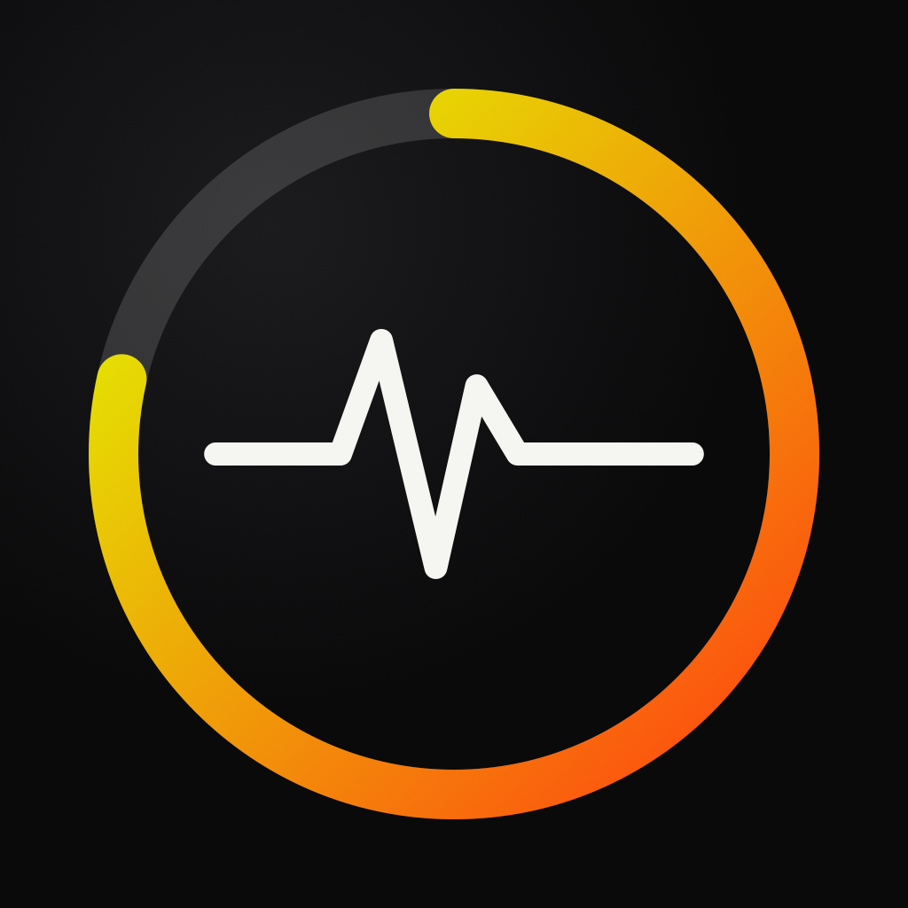
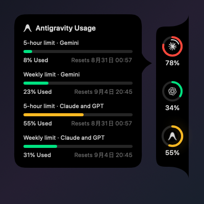
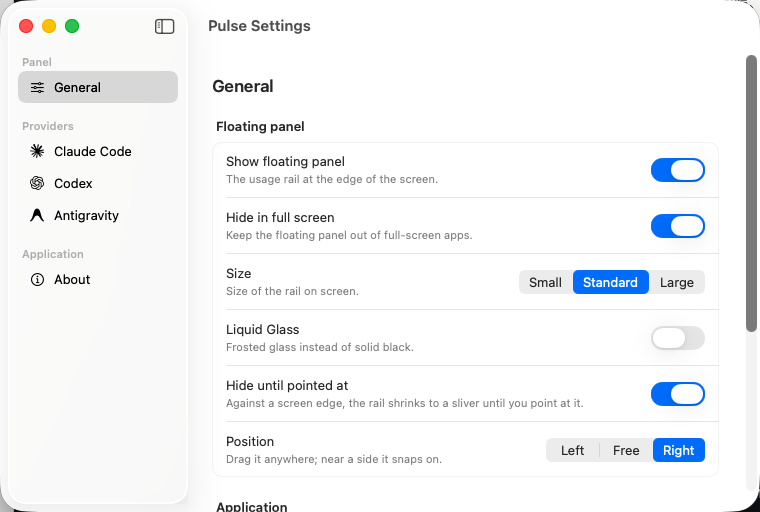

  

<h1 align="center">Pulse</h1>

  <b>How much Claude Code, Codex, Antigravity, Cursor, OpenCode Go, Kimi Code, Ollama Cloud, Z.ai, GLM, MiniMax, Grok, Grok Bot or GitHub Copilot you have left.</b>

  <b>macOS 14 Sonoma or newer</b> · Apple Silicon and Intel · <a href="README.zh-CN.md">简体中文</a>

  
  
  

  

Pulse is a small floating monitor that sits on the edge of your screen and
shows how much of your AI-coding allowance is left, using the limits each
provider reports for your account. There is no backend and no account of its
own.

## Install

Download the latest **`Pulse-x.y.z.dmg`** from
[Releases](https://github.com/qunqin24/Pulse/releases/latest), open it, and drag
Pulse into Applications.

Pulse isn't notarized, so macOS blocks the first launch. Open Pulse, dismiss
the warning, then go to **System Settings → Privacy & Security** and click
**Open Anyway**. Once only; later releases update themselves.

## What it does

- One ring per agent, coloured by usage: green, amber, red, deeper red when
  spent — or a colour you pick per account (a spent limit still turns red).
  Click a ring to refresh that provider.
- Point at a ring and a card opens with every limit the provider reports:
  what's spent, when each window resets, and an optional burn-rate forecast of
  whether the limit will last its window. Pin a specific window to its ring;
  the default is whichever is closest to its limit.
- Docks to either side of the screen or along the top (above the menu bar), or
  floats anywhere — including a second display, which it remembers. Folds to a
  thin sliver when you're away; the sliver turns red when a limit is nearly
  gone. Stays out of other apps' full-screen Spaces by default.
- A mark on the ring shows whether that agent is working right now (Claude
  Code and Codex only — the others keep no local transcript).
- Starts with the last readings, marked with when they were taken; a failed
  reading falls back to them rather than showing an error.
- Settings builds a spending history from Claude Code's and Codex's session
  logs, priced at published API rates, plus a labelled estimate of what a
  rate-limit window is worth.
- Multiple accounts per provider: sign in to a second Claude Code or Codex
  subscription and watch both side by side.
- Configurable: ring order, spacing, panel size, percentages on/off per rail,
  figure above or below the ring, counting down to what's left instead of up,
  custom ring colours per account, an optional arc showing how much of the
  window's time has passed, refresh interval, language (English and Simplified
  Chinese, no relaunch). Black panel by default; Liquid Glass optional on
  macOS 26.
- Opens at login by default — a decision taken once, so switching it off
  sticks. Updates itself through Sparkle, signed with an EdDSA key.
- Adaptive refresh between 2 and 30 minutes; a switched-off provider is never
  fetched.

  
  &nbsp;&nbsp;&nbsp;
  

## Where the numbers come from

| | Route | Note |
|---|---|---|
| **Claude Code** | The account's usage endpoint, using the login Claude Code already stored; falls back to the status line | — |
| **Codex** | The endpoint Codex's own client uses; falls back to `codex app-server` | — |
| **Antigravity** | The language server the editor runs locally | Reports only while Antigravity is open |
| **Cursor** | The account's usage summary, via the login the editor already stored | Shown as the two pools on Cursor's account page |
| **OpenCode Go** | An API key from Settings, or the login OpenCode's CLI already stored | — |
| **Kimi Code** | An API key from Settings | — |
| **Z.ai** | An API key from Settings | International storefront; a mainland BigModel key won't work here |
| **GLM Coding Plan** | An API key from Settings, or one the GLM tooling already saved | Mainland storefront (`open.bigmodel.cn`) |
| **MiniMax** / **MiniMax CN** | An API key from Settings | `api.minimax.io` and `api.minimaxi.com` |
| **Grok** | The Grok Build CLI's own proxy, using the login `grok login` already stored | One weekly pool, spent across every Grok product — not just the CLI |
| **Grok Bot** | Cursor's dashboard, using the login the Cursor editor already stored | A different limit from Grok above: it comes with a Cursor plan, not a SuperGrok one |
| **GitHub Copilot** | A sign-in, by device code | Asks for `read:user` and nothing else — not a pasted token |
| **Ollama Cloud** | The signed-in settings page, with a session read from your browser | No quota API exists. See [Docs/ollama-cloud.md](Docs/ollama-cloud.md) |

Every figure is what the provider reports; Pulse never estimates a percentage
from local token counts, and says so when a provider won't answer. A failed
reading falls back to the last good one with its time shown. A window whose
reset has passed is dropped.

## Privacy

Pulse has no backend. Most providers are read with a login your own tools
already stored on this Mac; the rest take an API key you paste in, and Ollama
Cloud's session is read from your browser (scoped to `ollama.com` and its
sign-in cookies only). Keys and sessions are stored encrypted in Pulse's own
folder, owner-only. Spending history is computed on-device. Nothing is
uploaded.

## Build from source

See [Docs/build-from-source.md](Docs/build-from-source.md).

## Layout

All source is in `Sources/Pulse`, one SwiftUI view per file, with the provider
marks under `Sources/Pulse/Resources`. [CLAUDE.md](CLAUDE.md) is the deeper
walkthrough.

## Design

Thank you, [**Vinz** (@hivinz_)](https://x.com/hivinz_/status/2092996055248126353).

Pulse is built from a concept he posted on X in August 2026: a rail of rings held against the edge of the screen, everything worth knowing in one glance and nothing else. That idea is his; most of the work here has been trying not to spoil it. He didn't build this and isn't responsible for it.

## License

[Apache 2.0](LICENSE). Bundled third-party assets keep their own licenses; see
[THIRD_PARTY_NOTICES.md](THIRD_PARTY_NOTICES.md).
