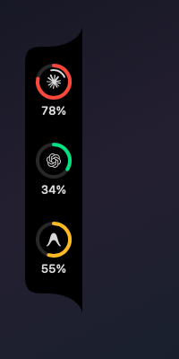

<p align="center">
  
</p>

<h1 align="center">Pulse</h1>

<p align="center">
  <b>不用离开手头的事，就知道 Claude Code、Codex、Antigravity、Cursor、<br>OpenCode Go、Kimi Code、Ollama Cloud 还剩多少额度。</b>
</p>

<p align="center">
  <sub><b>macOS 14 Sonoma 或更高</b> · Apple 芯片与 Intel 通用 · <a href="README.md">English</a></sub>
</p>

<p align="center">
  
</p>

Pulse 是一个贴在屏幕边缘的小浮窗。扫一眼圆环就知道自己在什么位置；你不在附近时它缩成一条细线，凑近了再回来。不用切到某个后台页面去查，也不会在任务干到一半时才发现限流了。

## 安装

从 [Releases](https://github.com/qunqin24/Pulse/releases/latest) 下载最新的 **`Pulse-x.y.z.dmg`**，打开后把 Pulse 拖进「应用程序」。

Pulse 还没有 Apple 开发者签名，所以首次启动会被 macOS 拦下——而且 macOS 15 之后，右键 →「打开」这个老办法已经被 Apple 去掉了。只需一次：

1. 打开 Pulse，被拒绝后关掉那个弹窗。
2. 进入 **系统设置 → 隐私与安全性**，滚到 **安全性**，点 **仍要打开**。
3. 再打开一次，确认。

之后就能正常启动了，后续版本会自己更新。

## 它能做什么



**七个 agent，一条胶囊。** Claude Code、Codex、Antigravity、Cursor、OpenCode Go、Kimi Code、Ollama Cloud 各占一个圆环。颜色在你读数字之前就告诉你还有多少余地——绿、黄、红。点某个圆环可以只刷新它。首次运行只会显示你这台机器上真正装了的那几个。

**是真实额度，不是估算。** 每个数字都来自供应商自己的账号。Pulse 从不根据本地 token 数反推百分比；供应商不给答案时，它就说不知道，而不是编一个看起来合理的。多数用的是对应 CLI 或客户端本来就存好的登录信息；没有这个可借的两家改成在设置里粘贴 API key，Ollama Cloud 则由 Pulse 替你从浏览器里读出会话。

**可以监控多个账号。** 在 Claude Code 或 Codex 的设置页里登录第二个订阅，两个一起看，各有各的名字和圆环。Pulse 是自己走一遍登录，而不是抄 CLI 存下来的令牌——借来的令牌在你当前没用的那个账号上几小时就失效，而续期又可能把你从自己的 CLI 里踢出去。授权页面上写的是 CLI 的名字，因为 Pulse 无法向这两家注册自己的 OAuth 应用；这不是官方集成，设置里也这么写着。

**它知道你在干活。** 某个 CLI 正在处理一轮对话时，对应圆环里会有一段标记在转——依据是对话记录里真实的回合边界，而不是「最近写过文件」，所以一个跑得慢的工具调用不会被误判成已经结束。只有 Claude Code 和 Codex 有这个功能——其余几家没有留在本机的对话记录可读。

**不碍事。** 可以吸附到屏幕左右任一边，也可以吸附到顶部——在菜单栏之上，而不是之下——还可以在桌面上自由放置。你不在附近时缩成 6pt 的细线，默认不进入其他应用的全屏空间。额度快用完时那条细线仍然会变红——一个会自己藏起来的监视器，总得留一种方式说「看我一眼」。

**花了多少钱。** 设置里会根据 Claude Code 和 Codex 自己的会话记录还原出一份消费历史，按各家公布的 API 价格计算——另外还有一个明确标注为「推算」的数字：当前这个额度窗口大概值多少钱。这个没有任何供应商会告诉你。其余几家没有留这份本机记录，做不出这个。

**自适应刷新。** 2 到 30 分钟之间浮动，没有变化时自动放慢，而不是全天候按固定频率轮询。启动时直接显示上一次的读数并标注取数时间，而不是空着等最慢的那家回应。

**摆法随你。** 圆环的顺序自己排，间距分三档，两种吸附方式下的百分比都可以关掉，也可以给某个账号指定一个固定颜色——不过默认仍然是按用量上色，因为选一个固定色等于主动放弃了这个读数。供应商判定为「已用尽」的额度，无论你选了什么颜色都显示用尽的红色。

支持简体中文和英文，切换无需重启。三档整体尺寸。macOS 26 上可选液态玻璃材质。

<p align="center">
  
  
</p>

## 这些数字是怎么来的

七家各自提供的读取方式完全不同，各有各的代价：

| | 读取方式 | 注意 |
|---|---|---|
| **Claude Code** | 账号的用量接口，用 Claude Code 已保存的登录信息；失败时回退到状态栏，Pulse 可以把自己注册上去 | 保存的令牌几小时就过期，且没有任何东西替 Pulse 续期，所以才需要回退 |
| **Codex** | Codex 自家客户端用的同一个接口，失败时回退到 `codex app-server` | 不是公开 API，随时可能变 |
| **Antigravity** | 编辑器在本机回环地址上跑的 language server | 只在 Antigravity 开着时才有数据——额度就存在那个进程里 |
| **Cursor** | 账号的用量摘要接口，用编辑器已保存的登录信息拼出所需的 cookie | 不是公开 API。按 Cursor 自己账号页的口径分成两个额度池，而不是合成一个数 |
| **OpenCode Go** | 在设置里粘贴一个 API key——如果你已经在 OpenCode 自己的 CLI 里登录过，也会用它保存的登录信息 | 不是公开 API，随时可能变 |
| **Kimi Code** | 在设置里粘贴一个 API key | 七家里唯一一个有公开文档的接口——但也不保证永远不变 |
| **Ollama Cloud** | 登录后的设置页，会话由 Pulse 替你从浏览器里读出 | 它根本没有额度 API，网页是唯一来源。详见 [Docs/ollama-cloud.md](Docs/ollama-cloud.md)（英文） |

自己添加的账号是通过 Pulse 走一遍登录的，用的是对应 CLI 那个公开客户端，并持有自己的刷新令牌——不碰 CLI 自己的任何东西。

某次读取失败时，会退回上一次成功的读数，并标注它是什么时候取的，而不是当成当前值糊弄过去。已经过了重置时间的窗口会被丢掉而不是继续变旧：它不是过期了，是已经重置了。

## 隐私

Pulse 没有自己的后端，也没有自己的账号。多数供应商用的是你自己的 CLI 或客户端本来就存在这台 Mac 上的登录信息。例外是 OpenCode Go 和 Kimi Code，要你自己粘贴一个 API key；以及 Ollama Cloud，它的会话由 Pulse 从浏览器读出——这个读取只针对 `ollama.com`、只取用于认证的那几个 cookie 名，浏览器里其余的东西一概不看。这三者都加密存在 Pulse 自己的文件夹里，仅本人可读，密钥由这台 Mac 推导而来，不写进 `UserDefaults`（那是个任何以你的身份运行的进程都能读的 plist）。

自己添加的账号的登录信息也是同样的存法。消费历史完全在本机从已有的日志文件算出来。没有任何数据被上传。

## 从源码构建

```bash
swift run Pulse              # 构建并运行
swift build                  # 全量类型检查，含 preview
./Scripts/bundle.sh          # → build.noindex/Pulse.app
./Scripts/dmg.sh             # → build.noindex/Pulse-<版本>.dmg
```

`xcode-select` 必须指向 Xcode 而不是 CommandLineTools——`#Preview` 宏是由 Xcode 自带的插件展开的。如果构建报 `PreviewsMacros plugin not found`：

```bash
sudo xcode-select -s /Applications/Xcode.app/Contents/Developer
```

Swift tools 6.0；用 `Package.swift` 可以直接在 Xcode 里打开。没有测试目标，也没有配 linter。

## 代码结构

源码都在 `Sources/Pulse`，一个 SwiftUI 视图一个文件，供应商图标在 `Sources/Pulse/Resources`。[CLAUDE.md](CLAUDE.md) 是更深入的说明（英文）——AppKit 浮窗与 SwiftUI 的分界、为什么拖拽归窗口管、七家各自的读取路径实际付出了什么代价。其中一家单独有一页：[Docs/ollama-cloud.md](Docs/ollama-cloud.md)（英文）——从浏览器里读会话这件事值得完整写下来。

## 设计来源

感谢 [**Vinz**(@hivinz_)](https://x.com/hivinz_/status/2092996055248126353)。

Pulse 的由来是他 2026 年 8 月在 X 上发的一个概念设计——给那些厌烦反复手动查
Claude、Codex 会话限制的人做的一版 Figma 稿。我第一眼就被它抓住了:一条贴在
屏幕边缘的圆环胶囊,该知道的一眼就有,多余的一个都没有。那个想法是他的,这里
大部分的工夫,其实是在尽量别把它做糟。

这里是照着那个想法独立做出来的实现。他没有参与开发,也不为它负责。

## 许可

[Apache 2.0](LICENSE)。内置的第三方素材保留各自的许可，见 [THIRD_PARTY_NOTICES.md](THIRD_PARTY_NOTICES.md)。
